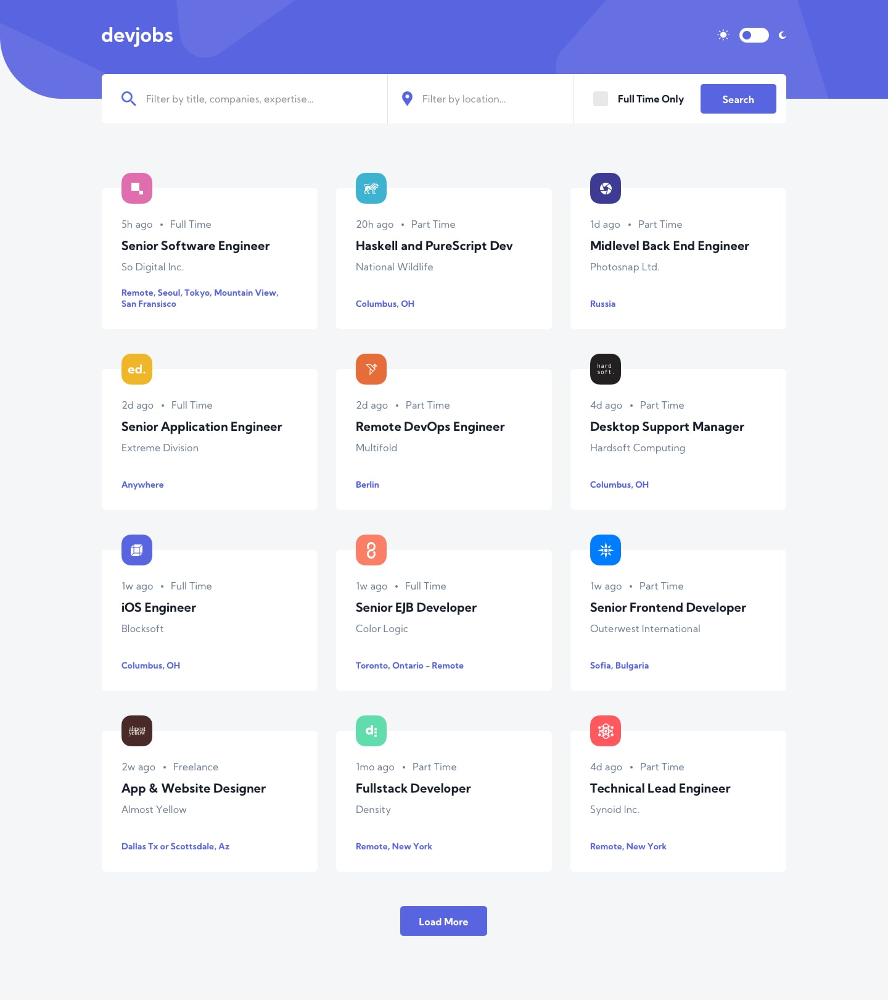

# Jobs Board



Jobs Board is a responsive web application that uses the GitHub Jobs API data. The app is build with **React** and **SCSS** with great UI and UX.

The functionalities of the app are:

- Filter jobs by title, companies, expentise...
- Filter by location
- Filter by **Full Time Only**
- A dark/light theme toggle
- Remeber user preferences
- View all jobs currently live on the GitHub Jobs API
- Load 50 jobs by default and let user request to load more
  - 50 jobs at a time
- View full job details
- Visit the website of the company that posted the job
- Apply for jobs

## Usage

### Install dependencies

```
npm install
```

### Run React dev server (http://localhost:3000)

```
npm start
```

### Build for production

```
npm run build
```
